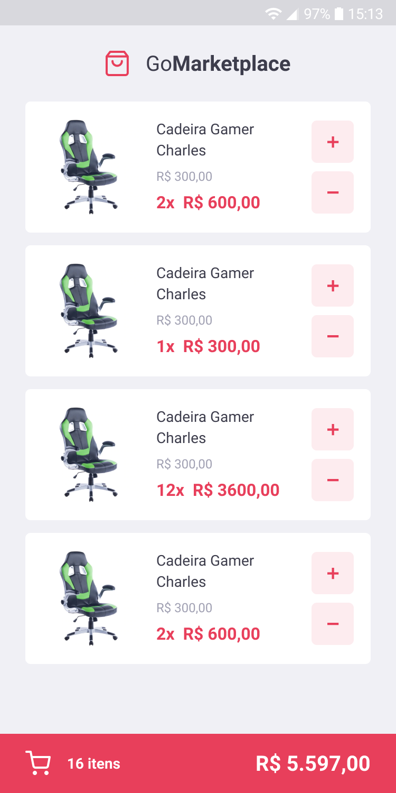

<h1 align="center">Welcome to GoMarketplace 👋</h1>
<p style="text-align: center">
  
  <a href="#" target="_blank">
    
  </a>
</p>

> A demo for mobile stores

## Screenshots 





## Runnig

```sh
yarn install
```

```sh
yarn android || yarn ios
```
```sh
yarn start
```


## Author

👤 **Alek Tobias <alektobias@gmail.com>**

* Github: [@alektobias](https://github.com/alektobias)
